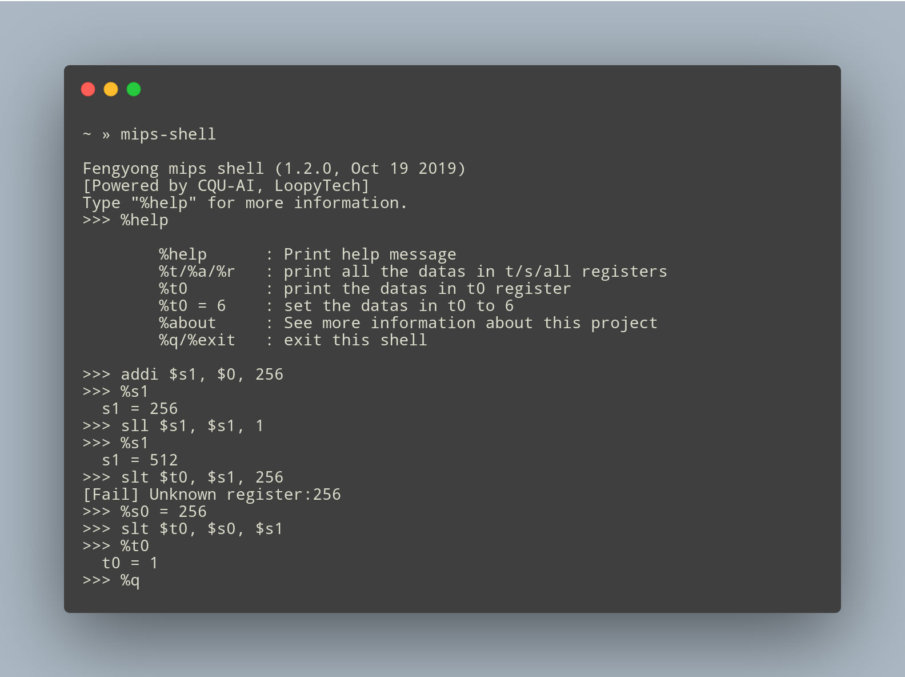

# MIPS-Simulator

  

## Introduction

MIPS-Simulator runs MIPS32 programs.
Unlike real simulator, which assembles the instructions into machine code and executes them,
MIPS-Simulator just parse the instructions and runs them using python code.
In other words, MIPS-simulator actually interprets mips instructions.



## Note

- This project is in its early stage, which means some functions may not supported yet.

## Install
 - With pip :`pip3 install fengyong`
 - With src : Clone or fork this project, then build it with `python3 setup.py install`

## Usage
### Shell
After install, you can run a mips shell with `mips-shell` command.

### Assemble
```python
from fengyong import Assembler

instructions = """
j 10000
add $s0,$a1,$t7
sw $s1,10($s2)"""

machine_code = Assembler.encode(instructions)
print(machine_code.bin)
print(machine_code.value_base(16))
```
### DisAssemble
```python
from fengyong import DisAssembler
from fengyong import  RegData

machine_code = RegData("0x8002710af820ae51000a")
instructions = DisAssembler.decode(machine_code)
print(instructions)
```

### Simulate - RUN!
 - Run mips instruction in line:
    ```python
   from fengyong import Simulator

   Simulator.run_line("addi $s0, $s1, 10")
    ```
 - Run asm file:
    ```python
   from fengyong import Simulator

   Simulator.run_file("../test/drings.asm")
    ```

### Simulate - Debug
 - Set the register data
    ```python
   from fengyong import Registers
   from fengyong import RegData

   Registers.reg_set("$s0",RegData(100))
   ```
 - Get the register data
    ```python
   from fengyong import Registers

   res = Registers.reg_get("$s0")

   # print all the "s" registers
   Registers.print("s")

   # print all registers
   Registers.print()
    ```

### Example
 - [Sample1](https://github.com/CQU-AI/pymips/tree/master/sample/sample)

## Contributing

Read [CONTRIBUTING](https://github.com/CQU-AI/pymips/blob/master/CONTRIBUTING.md) for more information.
